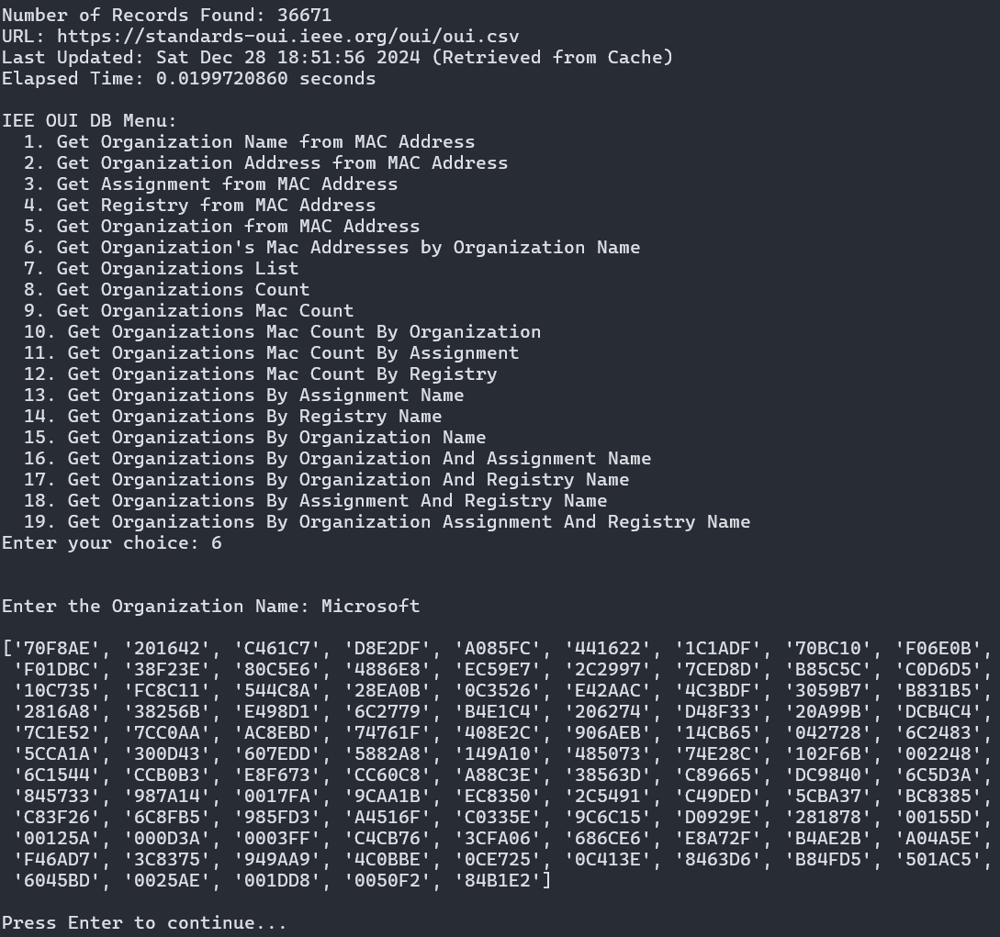

# NGS IEEE OUI Database

A dependency-free Python module for verifying Organizationally Unique Identifiers (OUIs)  against the IEEE's OUI database.

## Screenshot



## Table of Contents

- [Installation](#installation)
- [Usage](#usage)
  - Documentation
    - [Utils](./docs/utils.MD)
    - [Validators](./docs/validators.MD)
    - [IEE_OUI_DB](./docs/IEE_OUI.MD)
    - [Is IoT Device](./docs/isIot.MD)
    - [Command Line Interface](./docs/cli.MD)
    - [Extract IoT Manufacturers](./docs/extractIot.MD)
- [Tests](#tests)
- [License](#license)

## Installation

The only method for installation at the moment is to clone the repo and install the module locally by adding the project to the `PYTHONPATH` environment variable. Or to install locally using Pip. In the future, this may be added to PyPi.

1. Clone the repo:

    ```bash
    git clone https://github.com/iiTONELOC/ngs-ieee-oui-db.git
    ```

### Via PYTHONPATH

Installs system-wide, only recommended when virtual environments are not an option. For best results, [see Local Installation Via Pip](#via-pip-as-a-local-installation)

1. Add Directory to `PYTHONPATH`, be sure to replace absolute/path/to/ngs-ieee-oui-db with the absolute path to the downloaded repo

    ```bash
   echo 'export PYTHONPATH="/absolute/path/to/ngs-ieee-oui-db/:$PYTHONPATH"' >> ~/.bashrc
   ```

2. Reload .bashrc

    ```bash
    source ~/.bashrc
    ```

### Via Pip as a Local Installation

For best results, ensure that the project using the module is configured for a virtual environment

```bash
pip install /absolute/or/relative/path/to/ngs-ieee-oui-db

# example output
Processing /home/developer/code/python-projects/NG_OUI_DB
  Installing build dependencies ... done
  Getting requirements to build wheel ... done
  Preparing metadata (pyproject.toml) ... done
Building wheels for collected packages: NG_OUI_DB
  Building wheel for NG_OUI_DB (pyproject.toml) ... done
  Created wheel for NG_OUI_DB: filename=NG_OUI_DB-0.1.0-py3-none-any.whl size=11523 sha256=add09d786930cfce6b176341b149fec61aeceeb0a68a7980cfb072089040f7dd
  Stored in directory: /tmp/pip-ephem-wheel-cache-9rnrrdpk/wheels/d7/15/9f/23ba2c21ba1a35a37cb003b2dae0e826c7d3891100e1e7f9d2
Successfully built NG_OUI_DB
Installing collected packages: NG_OUI_DB
  Attempting uninstall: NG_OUI_DB
    Found existing installation: NG_OUI_DB 0.1.0
    Uninstalling NG_OUI_DB-0.1.0:
      Successfully uninstalled NG_OUI_DB-0.1.0
Successfully installed NG_OUI_DB-0.1.0
```

## Usage

```python
from NG_OUI_DB import IeeOuiDb

db = IeeOuiDb()

# get information about the mac
man = db.getOrganization("00:00:00:00:00:00")

print(man)

#expects
{
    "Registry": "MA-L",
    "Assignment": "000000",
    "Organization Name": "XEROX CORPORATION",
    "Organization Address": "M/S 105-50C WEBSTER NY US 14580",
}
```

For more usage information check out the documentation, which provides a basic overview for each item exported by the module:

- Documentation:
  - [Utils](./docs/utils.MD)
  - [Validators](./docs/validators.MD)
  - [IEE_OUI_DB](./docs/IEE_OUI.MD)
  - [Is IoT Device](./docs/isIot.MD)
  - [Command Line Interface](./docs/cli.MD)
  - [Extract IoT Manufacturers](./docs/extractIot.MD)

## Tests

Tests are included in the `./tests` directory and can be verified with pytest.

  ```bash
    pytest -vv ./tests/
    ================================== test session starts ===================================
    platform linux -- Python 3.12.3, pytest-7.4.4, pluggy-1.4.0 -- /usr/bin/python3
    cachedir: .pytest_cache
    rootdir: /home/developer/code/python-projects/NG_OUI_DB
    collected 25 items

    tests/test_IeeOuiDb.py::test_getDb PASSED                                          [  4%]
    tests/test_IeeOuiDb.py::test_getDbUrl PASSED                                       [  8%]
    tests/test_IeeOuiDb.py::test_getOrganizationName PASSED                            [ 12%]
    tests/test_IeeOuiDb.py::test_getOrganizationAddress PASSED                         [ 16%]
    tests/test_IeeOuiDb.py::test_getAssignment PASSED                                  [ 20%]
    tests/test_IeeOuiDb.py::test_getRegistry PASSED                                    [ 24%]
    tests/test_IeeOuiDb.py::test_getOrganization PASSED                                [ 28%]
    tests/test_IeeOuiDb.py::test_getOrganizationsMac PASSED                            [ 32%]
    tests/test_IeeOuiDb.py::test_getOrganizations PASSED                               [ 36%]
    tests/test_IeeOuiDb.py::test_getOrganizationsCount PASSED                          [ 40%]
    tests/test_IeeOuiDb.py::test_getOrganizationsMacCount PASSED                       [ 44%]
    tests/test_IeeOuiDb.py::test_getOrganizationsMacCountByOrganization PASSED         [ 48%]
    tests/test_IeeOuiDb.py::test_getOrganizationsMacCountByAssignment PASSED           [ 52%]
    tests/test_IeeOuiDb.py::test_getOrganizationsMacCountByRegistry PASSED             [ 56%]
    tests/test_IeeOuiDb.py::test_getOrganizationsByAssignment PASSED                   [ 60%]
    tests/test_IeeOuiDb.py::test_getOrganizationsByRegistry PASSED                     [ 64%]
    tests/test_IeeOuiDb.py::test_getOrganizationsByOrganization PASSED                 [ 68%]
    tests/test_IeeOuiDb.py::test_getOrganizationsByOrganizationAndAssignment PASSED    [ 72%]
    tests/test_IeeOuiDb.py::test_getOrganizationsByOrganizationAndRegistry PASSED      [ 76%]
    tests/test_IeeOuiDb.py::test_getOrganizationsByAssignmentAndRegistry PASSED        [ 80%]
    tests/test_IeeOuiDb.py::test_getOrganizationsByOrganizationAssignmentAndRegistry PASSED [ 84%]
    tests/test_extractIoTMans.py::test_getIotManufacturers PASSED                      [ 88%]
    tests/test_isIoT.py::test_isIoT PASSED                                             [ 92%]
    tests/test_validators.py::test_AlphaNumericAsciiRegexPattern PASSED                [ 96%]
    tests/test_validators.py::test_MacAddressRegexPattern PASSED                       [100%]

    =================================== 25 passed in 0.65s ===================================
  ```

## License

[License](./LICENSE)
